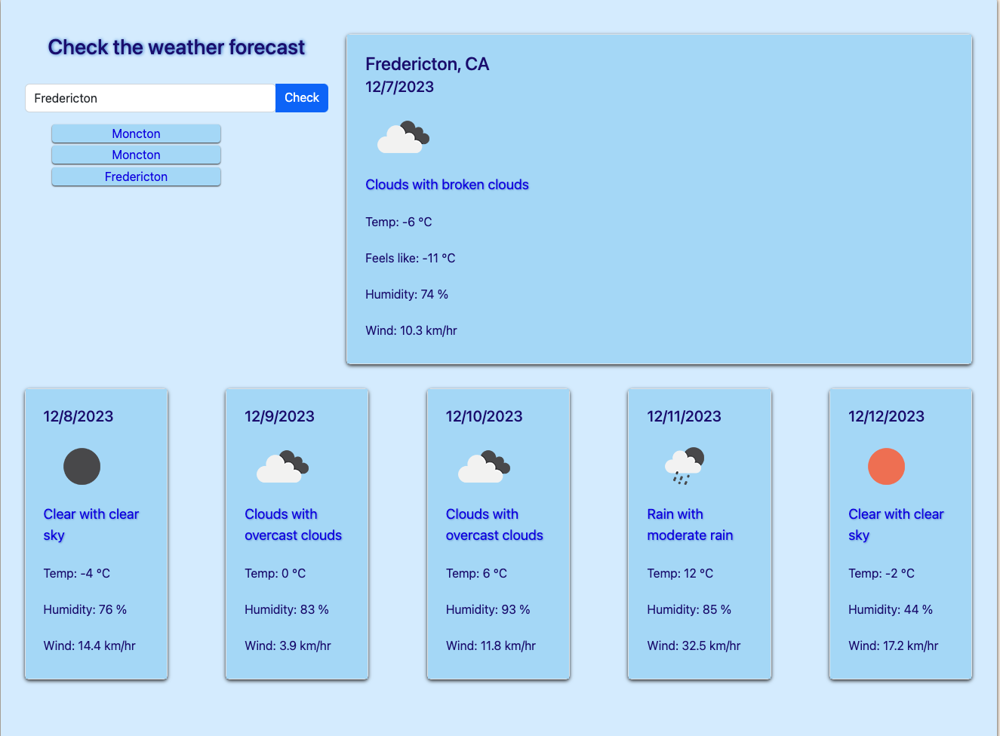

# Weather Dashboard

A weather 5-day forecast dashboard using a server-side API, HTML, CSS & JS.

## Usage

Type in the city name you want the weather for and press the check button or 'Enter'. The dashboard will be populated with the current weather data, weather icons and a 5 day forecast. Your searches will be saved and displayed for later use.

## User Story

```text
AS A traveler
I WANT to see the weather outlook for multiple cities
SO THAT I can plan a trip accordingly
```

## Acceptance Criteria

```text
GIVEN a weather dashboard with form inputs
WHEN I search for a city
THEN I am presented with current and future conditions for that city and that city is added to the search history
WHEN I view current weather conditions for that city
THEN I am presented with the city name, the date, an icon representation of weather conditions, the temperature, the humidity, and the wind speed
WHEN I view future weather conditions for that city
THEN I am presented with a 5-day forecast that displays the date, an icon representation of weather conditions, the temperature, the wind speed, and the humidity
WHEN I click on a city in the search history
THEN I am again presented with current and future conditions for that city
```

## Mock-Up

The following shows the web applications appearance:



[Click here to visit!](https://cookingmeister.github.io/weather-dashboard/)

## Credits

I started with a Bootstrap weather card template that I expanded and duplicated. The assignment from Edx gave a hint that geo coordinates could be obtained first from the city name and then used later to search for weather data, which I incorporated.
MDN Web Docs, W3Schools and Google searches were an asset for completing this application.

## License

Please see attached license file.
